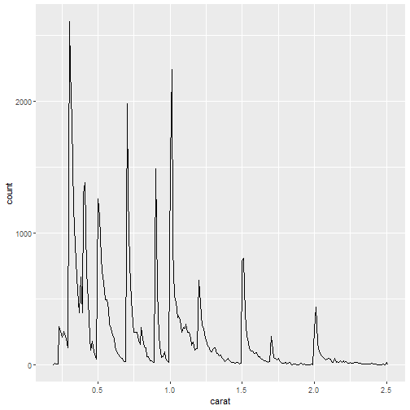

We have data about 53940 diamonds. Only 
126 are larger than
2.5 carats. The distribution of the remainder is shown
below:

---
27.3.1 Exercise 3
---
---
TODO
---

---
27.4.7 Exercise 1
---
---
TODO
---
