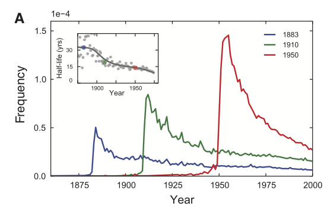

### 3. Culturomics

#### Problem statement

Note: This is Exercise 6 in Chapter 2 of [Bit By Bit: Social Research in the Digital Age](https://www.bitbybitbook.com/en/1st-ed/observing-behavior/observing-activities/) by Matt Salganik. 

In a widely discussed paper, Michel and colleagues ([2011](https://doi.org/10.1126/science.1199644)) analyzed the content of more than five million digitized books in an attempt to identify long-term cultural trends. The data that they used has now been released as the Google NGrams dataset, and so we can use the data to replicate and extend some of their work.

In one of the many results in the paper, Michel and colleagues argued that we are forgetting faster and faster. For a particular year, say “1883,” they calculated the proportion of 1-grams published in each year between 1875 and 1975 that were “1883”. They reasoned that this proportion is a measure of the interest in events that happened in that year. In their figure 3a, they plotted the usage trajectories for three years: 1883, 1910, and 1950. These three years share a common pattern: little use before that year, then a spike, then decay. Next, to quantify the rate of decay for each year, Michel and colleagues calculated the “half-life” of each year for all years between 1875 and 1975. In their figure 3a (inset), they showed that the half-life of each year is decreasing, and they argued that this means that we are forgetting the past faster and faster. They used Version 1 of the English language corpus, but subsequently Google has released a second version of the corpus. Please read all the parts of the question before you begin coding.

This activity will give you practice writing reusable code, interpreting results, and data wrangling (such as working with awkward files and handling missing data). This activity will also help you get up and running with a rich and interesting dataset.

The full paper can be found [here](https://aidenlab.org/papers/Science.Culturomics.pdf), and this is the original figure 3a that you're going to replicate:

a) Get the raw data from the [Google Books NGram Viewer website](http://storage.googleapis.com/books/ngrams/books/datasetsv2.html). In particular, you should use version 2 of the English language corpus, which was released on July 1, 2012. Uncompressed, this file is 1.4GB.

b) Recreate the main part of figure 3a of Michel et al. (2011). To recreate this figure, you will need two files: the one you downloaded in part (a) and the “total counts” file, which you can use to convert the raw counts into proportions. Note that the total counts file has a structure that may make it a bit hard to read in. Does version 2 of the NGram data produce similar results to those presented in Michel et al. (2011), which are based on version 1 data?

c) Now check your graph against the graph created by the [NGram Viewer](https://books.google.com/ngrams/).

d) Recreate figure 3a (main figure), but change the y-axis to be the raw mention count (not the rate of mentions).

e) Does the difference between (b) and (d) lead you to reevaluate any of the results of Michel et al. (2011). Why or why not?

f) Now, using the proportion of mentions, replicate the inset of figure 3a. That is, for each year between 1875 and 1975, calculate the half-life of that year. The half-life is defined to be the number of years that pass before the proportion of mentions reaches half its peak value. Note that Michel et al. (2011) do something more complicated to estimate the half-life—see section III.6 of the Supporting Online Information—but they claim that both approaches produce similar results. Does version 2 of the NGram data produce similar results to those presented in Michel et al. (2011), which are based on version 1 data? (Hint: Don’t be surprised if it doesn’t.)

g) Were there any years that were outliers such as years that were forgotten particularly quickly or particularly slowly? Briefly speculate about possible reasons for that pattern and explain how you identified the outliers.

#### Template

A template has been provided for a solution.

Edit the `01_download_1grams.sh` file to download the `googlebooks-eng-all-1gram-20120701-1.gz` file and the `02_filter_1grams.sh` file to filter the original 1gram file to only lines where the ngram matches a year (output to a file named `year_counts.tsv`).

Then edit the `03_download_totals.sh` file to down the `googlebooks-eng-all-totalcounts-20120701.txt` and  file and the `04_reformat_totals.sh` file to reformat the total counts file to a valid csv (output to a file named `total_counts.csv`). 

Place the rest of your solution in the `05_final_report.Rmd` file and render it to a pdf file.

Finally, edit the `Makefile` in this directory to execute the full set of scripts that download the data, clean it, and produce this report. This must be turned in with your assignment such that running `make` on the command line produces your final pdf file.