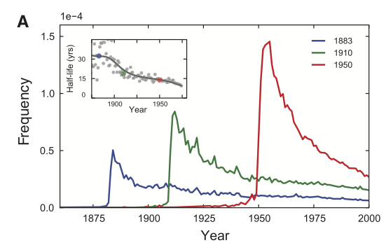

```{r setup, include=FALSE}
library(here)
library(scales)
library(tidyverse)

theme_set(theme_bw())

knitr::opts_chunk$set(echo = TRUE)
```

# Description

This is a template for exercise 6 in Chapter 2 of [Bit By Bit: Social Research in the Digital Age](https://www.bitbybitbook.com/en/1st-ed/observing-behavior/observing-activities/) by Matt Salganik. The problem is reprinted here with some additional comments and structure to facilitate a solution.

The original problem statement:

> In a widely discussed paper, Michel and colleagues ([2011](https://doi.org/10.1126/science.1199644)) analyzed the content of more than five million digitized books in an attempt to identify long-term cultural trends. The data that they used has now been released as the Google NGrams dataset, and so we can use the data to replicate and extend some of their work.
>
> In one of the many results in the paper, Michel and colleagues argued that we are forgetting faster and faster. For a particular year, say “1883,” they calculated the proportion of 1-grams published in each year between 1875 and 1975 that were “1883”. They reasoned that this proportion is a measure of the interest in events that happened in that year. In their figure 3a, they plotted the usage trajectories for three years: 1883, 1910, and 1950. These three years share a common pattern: little use before that year, then a spike, then decay. Next, to quantify the rate of decay for each year, Michel and colleagues calculated the “half-life” of each year for all years between 1875 and 1975. In their figure 3a (inset), they showed that the half-life of each year is decreasing, and they argued that this means that we are forgetting the past faster and faster. They used Version 1 of the English language corpus, but subsequently Google has released a second version of the corpus. Please read all the parts of the question before you begin coding.
>
> This activity will give you practice writing reusable code, interpreting results, and data wrangling (such as working with awkward files and handling missing data). This activity will also help you get up and running with a rich and interesting dataset.

The full paper can be found [here](https://aidenlab.org/papers/Science.Culturomics.pdf), and this is the original figure 3a that you're going to replicate:

> 

# Part A

> Get the raw data from the [Google Books NGram Viewer website](http://storage.googleapis.com/books/ngrams/books/datasetsv2.html). In particular, you should use version 2 of the English language corpus, which was released on July 1, 2012. Uncompressed, this file is 1.4GB.

## Get and clean the raw data

Edit the `01_download_1grams.sh` file to download the `googlebooks-eng-all-1gram-20120701-1.gz` file and the `02_filter_1grams.sh` file to filter the original 1gram file to only lines where the ngram matches a year (output to a file named `year_counts.tsv`).

Then edit the `03_download_totals.sh` file to down the `googlebooks-eng-all-totalcounts-20120701.txt` and  file and the `04_reformat_totals.sh` file to reformat the total counts file to a valid csv (output to a file named `total_counts.csv`). 

## Load the cleaned data

Load in the `year_counts.tsv` and `total_counts.csv` files. Use the `here()` function around the filename to keep things portable.Give the columns of `year_counts.tsv` the names `term`, `year`, `volume`, and `book_count`. Give the columns of `total_counts.csv` the names `year`, `total_volume`, `page_count`, and `book_count`. Note that column order in these files may not match the examples in the documentation.

```{r load-counts}
totals <- read.csv("total_counts.csv", header=FALSE)
colnames(totals) <- c("year", "total_volume", "page_count", "book_count")

totals <- na.omit(totals)

years<-read.delim("years_count.tsv",sep="\t")
colnames(years) <- c("term", "year", "volume", "book_count")
```

## Your written answer

Add a line below using Rmarkdown's inline syntax to print the total number of lines in each dataframe you've created.


`r nrow(years)`
`r nrow(totals)`


# Part B

> Recreate the main part of figure 3a of Michel et al. (2011). To recreate this figure, you will need two files: the one you downloaded in part (a) and the “total counts” file, which you can use to convert the raw counts into proportions. Note that the total counts file has a structure that may make it a bit hard to read in. Does version 2 of the NGram data produce similar results to those presented in Michel et al. (2011), which are based on version 1 data?

## Join ngram year counts and totals

Join the raw year term counts with the total counts and divide to get a proportion of mentions for each term normalized by the total counts for each year.

```{r join-years-and-totals}
year_totals <- years |>  group_by(year, term) |> 
  summarize(count = sum(volume)) 

proportions <- totals |> full_join(year_totals) |> mutate(prop=count/total_volume) |> 
  select(year, total_volume, term, prop, count)

```

## Plot the main figure 3a

Plot the proportion of mentions for the terms "1883", "1910", and "1950" over time from 1850 to 2012, as in the main figure 3a of the original paper. Use the `percent` function from the `scales` package for a readable y axis. Each term should have a different color, it's nice if these match the original paper but not strictly necessary.

```{r plot-proportion-over-time}
proportions |> 
  filter(term == "1883" | term == "1910" | term == "1950") |>
  filter(year >= 1850 & year <= 2012) |> ggplot() + 
   geom_line(aes(x = year, y = prop, color = as.factor(term))) +
   xlab("Year") +
   ylab("Proportion (%)") + 
  scale_y_continuous(label=label_percent(scale=100, suffix="")) + 
   guides(color = guide_legend(title = "Term"))
```

## Your written answer

The overall proportions of each term tends to be similar to the ones published in the paper. However, there are some discrepancies in the proportions after the peak of each term. For example, there is a bigger local peak in the papers 1910 term around 1925 than the one in this file. 

# Part C

> Now check your graph against the graph created by the [NGram Viewer](https://books.google.com/ngrams/).

## Compare to the NGram Viewer

Go to the ngram viewer, enter the terms "1883", "1910", and "1950" and take a screenshot.

## Your written answer

Add your screenshot for Part C below this line using the `` syntax and comment on similarities / differences.


# Part D

> Recreate figure 3a (main figure), but change the y-axis to be the raw mention count (not the rate of mentions).

## Plot the main figure 3a with raw counts

Plot the raw counts for the terms "1883", "1910", and "1950" over time from 1850 to 2012. Use the `comma` function from the `scales` package for a readable y axis. The colors for each term should match your last plot, and it's nice if these match the original paper but not strictly necessary.

```{r plot-raw-mentions-over-time}
year_totals |> 
  filter(term == "1883" | term == "1910" | term == "1950") |>
  filter(year >= 1850 & year <= 2012) |> ggplot() + 
  geom_line(aes(x = year, y = count, color = as.factor(term))) +
  scale_y_continuous(label = comma) +
  ylab("Total Conut") +
  xlab("Year") +
  guides(color = guide_legend(title = "Term"))

```

# Part E

> Does the difference between (b) and (d) lead you to reevaluate any of the results of Michel et al. (2011). Why or why not?

As part of answering this question, make an additional plot.

## Plot the totals

Plot the total counts for each year over time, from 1850 to 2012. Use the `comma` function from the `scales` package for a readable y axis. There should be only one line on this plot (not three).

```{r plot-totals}
totals |> 
  filter(year >= 1850 & year <= 2012) |> 
  group_by(year) |> 
  ggplot(aes(year, total_volume)) + geom_line() +
  scale_y_continuous(label=comma) +
  ylab("Total Conut") +
  xlab("Year") 
```

## Your written answer

The proportion of each term is decreasing as we get closer to more recent years. However, the total usage of each term increases as we move closer to more recent years. It seems to indicate that the usage of each word is growing along with all print, thereby greatly increasing the usage of words even at a cost to its proportion.

# Part F

> Now, using the proportion of mentions, replicate the inset of figure 3a. That is, for each year between 1875 and 1975, calculate the half-life of that year. The half-life is defined to be the number of years that pass before the proportion of mentions reaches half its peak value. Note that Michel et al. (2011) do something more complicated to estimate the half-life—see section III.6 of the Supporting Online Information—but they claim that both approaches produce similar results. Does version 2 of the NGram data produce similar results to those presented in Michel et al. (2011), which are based on version 1 data? (Hint: Don’t be surprised if it doesn’t.)

## Compute peak mentions

For each year term, find the year where its proportion of mentions peaks (hits its highest value). Store this in an intermediate dataframe.

```{r compute-peaks}
peak <- proportions |> 
  filter (year > 1850) |> 
  filter(term %in% 1875:1975) |> 
  group_by(term)  |> 
  mutate(maximum = max(prop)) |> 
  filter(maximum == prop) |> 
  select(term, peak_year=year)
```

## Compute half-lifes

Now, for each year term, find the minimum number of years it takes for the proportion of mentions to decline from its peak value to half its peak value. Store this in an intermediate data frame.

```{r compute-half-lifes}
half_life <- proportions |> 
  filter (year > 1850) |> 
  filter(term %in% 1875:1975) |> 
  group_by(term) |> 
  mutate(half = max(prop)/2) |> full_join(peak) |> filter(year > peak_year) |> 
  mutate(minimum = abs(half - prop)) |> 
  slice(which.min(minimum)) |> select(term, peak_year, half_year=year) |> 
  mutate(diff = half_year - peak_year)
```

## Plot the inset of figure 3a

Plot the half-life of each term over time from 1850 to 2012. Each point should represent one year term, and add a line to show the trend using `geom_smooth()`.


```{r plot-half-lifes}
half_life |> ggplot(aes(half_year, diff)) + 
  geom_point() + geom_smooth(se=F) + xlab("Hlaf =-life Year") + ylab("Half Life")
```

## Your written answer

No, their is a difference in the overall trend of the smoothed plot (I'm honestly not sure what I was plotting). The plot given in the paper shows a decline in the half life as time passes, while the plot shown above displays a normalization in the half-life of each term at around 10 years

# Part G

> Were there any years that were outliers such as years that were forgotten particularly quickly or particularly slowly? Briefly speculate about possible reasons for that pattern and explain how you identified the outliers.

## Your written answer


`r half_life |> arrange(diff) |> tail()`
`r half_life |> arrange(diff) |> head()`

It seem like the years with lower half life happen around times of notable global events like the world wars or the start of the gold rush. I would assume that those years were refereed to by the notable events more often than the years it happened. Similarly, years greater half life are likely years that have notable events without a specific name, meaning people refer to the year instead of the events in that year

# Makefile

Edit the `Makefile` in this directory to execute the full set of scripts that download the data, clean it, and produce this report. This must be turned in with your assignment such that running `make` on the command line produces the final report as a pdf file.
