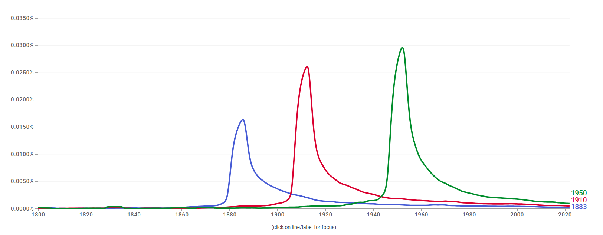

```{r setup, include=FALSE}
library(here)
library(scales)
library(tidyverse)

theme_set(theme_bw())

knitr::opts_chunk$set(echo = TRUE)
```

# Description

This is a template for exercise 6 in Chapter 2 of [Bit By Bit: Social Research in the Digital Age](https://www.bitbybitbook.com/en/1st-ed/observing-behavior/observing-activities/) by Matt Salganik. The problem is reprinted here with some additional comments and structure to facilitate a solution.

The original problem statement:

> In a widely discussed paper, Michel and colleagues ([2011](https://doi.org/10.1126/science.1199644)) analyzed the content of more than five million digitized books in an attempt to identify long-term cultural trends. The data that they used has now been released as the Google NGrams dataset, and so we can use the data to replicate and extend some of their work.
>
> In one of the many results in the paper, Michel and colleagues argued that we are forgetting faster and faster. For a particular year, say “1883,” they calculated the proportion of 1-grams published in each year between 1875 and 1975 that were “1883”. They reasoned that this proportion is a measure of the interest in events that happened in that year. In their figure 3a, they plotted the usage trajectories for three years: 1883, 1910, and 1950. These three years share a common pattern: little use before that year, then a spike, then decay. Next, to quantify the rate of decay for each year, Michel and colleagues calculated the “half-life” of each year for all years between 1875 and 1975. In their figure 3a (inset), they showed that the half-life of each year is decreasing, and they argued that this means that we are forgetting the past faster and faster. They used Version 1 of the English language corpus, but subsequently Google has released a second version of the corpus. Please read all the parts of the question before you begin coding.
>
> This activity will give you practice writing reusable code, interpreting results, and data wrangling (such as working with awkward files and handling missing data). This activity will also help you get up and running with a rich and interesting dataset.

The full paper can be found [here](https://aidenlab.org/papers/Science.Culturomics.pdf), and this is the original figure 3a that you're going to replicate:

> 

# Part A

> Get the raw data from the [Google Books NGram Viewer website](http://storage.googleapis.com/books/ngrams/books/datasetsv2.html). In particular, you should use version 2 of the English language corpus, which was released on July 1, 2012. Uncompressed, this file is 1.4GB.

## Get and clean the raw data

Edit the `01_download_1grams.sh` file to download the `googlebooks-eng-all-1gram-20120701-1.gz` file and the `02_filter_1grams.sh` file to filter the original 1gram file to only lines where the ngram matches a year (output to a file named `year_counts.tsv`).

Then edit the `03_download_totals.sh` file to down the `googlebooks-eng-all-totalcounts-20120701.txt` and  file and the `04_reformat_totals.sh` file to reformat the total counts file to a valid csv (output to a file named `total_counts.csv`). 

## Load the cleaned data

Load in the `year_counts.tsv` and `total_counts.csv` files. Use the `here()` function around the filename to keep things portable.Give the columns of `year_counts.tsv` the names `term`, `year`, `volume`, and `book_count`. Give the columns of `total_counts.csv` the names `year`, `total_volume`, `page_count`, and `book_count`. Note that column order in these files may not match the examples in the documentation.

```{r load-counts}
# volume = total frequency the term occured
year_counts <- read_tsv('year_counts.tsv',
                    col_names = c('term', 'year', 'volume', 'book_count'))
total_counts <- read_csv('total_counts.csv',
                    col_names = c('year', 'total_volume', 'page_count','total_book_count'))

```

## Your written answer

Add a line below using Rmarkdown's inline syntax to print the total number of lines in each dataframe you've created.

# Part B
```{r} 
nrow(year_counts)
nrow(total_counts)
```

> Recreate the main part of figure 3a of Michel et al. (2011). To recreate this figure, you will need two files: the one you downloaded in part (a) and the “total counts” file, which you can use to convert the raw counts into proportions. Note that the total counts file has a structure that may make it a bit hard to read in. Does version 2 of the NGram data produce similar results to those presented in Michel et al. (2011), which are based on version 1 data?

## Join ngram year counts and totals

Join the raw year term counts with the total counts and divide to get a proportion of mentions for each term normalized by the total counts for each year.

```{r join-years-and-totals}
df_3a <- left_join(year_counts, total_counts, by = 'year') %>%
        mutate(proportion = volume/total_volume) %>%
        filter(term == '1883' | term == '1910' | term == '1950')  %>%
        filter(year >= 1850 & year <= 2012)
```

## Plot the main figure 3a

Plot the proportion of mentions for the terms "1883", "1910", and "1950" over time from 1850 to 2012, as in the main figure 3a of the original paper. Use the `percent` function from the `scales` package for a readable y axis. Each term should have a different color, it's nice if these match the original paper but not strictly necessary.

```{r plot-proportion-over-time}
df_3a %>%
ggplot(mapping = aes(x = year, y = proportion, color = factor(term))) +
  geom_line(linewidth = 1.2) +
  scale_color_manual(values = c(
    "1883" = "darkblue",
    "1910" = "darkgreen", 
    "1950" = "red"
  )) +
  labs(
    title = 'Proportion Over Time (3A)',
    color = 'Term',
    x = 'Year',
    y = 'Frequency'
  ) +
  scale_y_continuous(labels = scales::percent)
```

Does version 2 of the NGram data produce similar results to those presented in Michel et al. (2011), 
which are based on version 1 data?

## Your written answer

Version 2 of the Ngram data produces similar results to those presented in Michel et al. (2011). 
The main difference is that, rather than increasing smoothly to its maximum, 
the frequency shows a slight dip just before reaching its peak. Additionally, the proportions 
appear to be scaled differently, with the values differing by a factor of approximately (10^4).


# Part C

> Now check your graph against the graph created by the [NGram Viewer](https://books.google.com/ngrams/).

## Compare to the NGram Viewer

Go to the ngram viewer, enter the terms "1883", "1910", and "1950" and take a screenshot.

## Your written answer
The Ngram Viewer graph shows a similar overall trend to my Version 2 graph, with both displaying the same general pattern and peaks. 
However, the Ngram Viewer shows a smoother decline after the peak, while my graph is more noisy, with small spikes up and down during 
the downward trend. The y-axis values are also slightly different, with my graph showing generally lower 
proportions compared to the Ngram Viewer output. Despite these differences, the overall pattern remains consistent between the two graphs.

Add your screenshot for Part C below this line using the `` syntax and comment on similarities / differences.



# Part D

> Recreate figure 3a (main figure), but change the y-axis to be the raw mention count (not the rate of mentions).

## Plot the main figure 3a with raw counts

Plot the raw counts for the terms "1883", "1910", and "1950" over time from 1850 to 2012. Use the `comma` function from the `scales` package for a readable y axis. The colors for each term should match your last plot, and it's nice if these match the original paper but not strictly necessary.

```{r plot-raw-mentions-over-time}
df_partd <- year_counts %>%
        filter(term == '1883' | term == '1910' | term == '1950')  %>%
        filter(year >= 1850 & year <= 2012)

df_partd %>%
ggplot(mapping = aes(x = year, y = volume, color = factor(term))) +
  geom_line(linewidth = 1.2) +
  scale_color_manual(values = c(
    "1883" = "darkblue",
    "1910" = "darkgreen", 
    "1950" = "red"
  )) +
  labs(
    title = 'Raw Mentions Over Time',
    color = 'Term',
    x = 'Year',
    y = 'Frequency'
  ) +
  scale_y_continuous(labels = scales::label_comma())

```

# Part E

> Does the difference between (b) and (d) lead you to reevaluate any of the results of Michel et al. (2011). Why or why not?

As part of answering this question, make an additional plot.

## Plot the totals

Plot the total counts for each year over time, from 1850 to 2012. Use the `comma` function from the `scales` package for a readable y axis. There should be only one line on this plot (not three).

```{r plot-totals}
df_parte <- total_counts %>%
filter(year >= 1850 & year <= 2012)

df_parte %>%
ggplot(mapping = aes(x = year, y = total_volume)) +
geom_line() +
labs(
  title = 'Total 1-gram Token Counts by Year (1850-2012)',
  x = 'Year',
  y = 'Frequency'
) +
scale_y_continuous(labels = scales::label_comma())

```

## Your written answer

Write up your answer to Part E here.
The difference between (b) and (d) does lead to some reevaluation of the results in Michel et al. (2011), 
because switching from proportions to raw mention counts changes how the data is interpreted. 
Using proportions controls for changes in the total number of books over time, while raw counts are 
influenced by overall corpus size. As a result, some of the patterns in (d) may reflect growth in the number 
of published books rather than genuine changes in word usage frequency.

However, this does not fundamentally change the main conclusions of Michel et al. (2011),
since the overall trends and key peaks remain similar. The proportional data in (b) is still 
more appropriate for comparing word usage over time, so the original findings remain largely valid.

# Part F

> Now, using the proportion of mentions, replicate the inset of figure 3a. That is, for each year between 1875 and 1975, calculate the half-life of that year. The half-life is defined to be the number of years that pass before the proportion of mentions reaches half its peak value. Note that Michel et al. (2011) do something more complicated to estimate the half-life—see section III.6 of the Supporting Online Information—but they claim that both approaches produce similar results. Does version 2 of the NGram data produce similar results to those presented in Michel et al. (2011), which are based on version 1 data? (Hint: Don’t be surprised if it doesn’t.)

## Compute peak mentions

For each year term, find the year where its proportion of mentions peaks (hits its highest value). Store this in an intermediate dataframe.

proportion_peaks
```{r compute-peaks}


df <- left_join(year_counts, total_counts, by = 'year') %>%
mutate(proportion = volume/total_volume) %>%
filter(term >= 1875 & term <= 1975) %>%
filter(year >= 1850 & year <= 2012)

df_peaks <- df %>%
group_by(term) %>%
slice_max(proportion, n = 1, with_ties = FALSE) %>%
rename('peak_year' = 'year') %>%
select(term, peak_year)

``` 

## Compute half-lifes

Now, for each year term, find the minimum number of years it takes for the proportion of mentions to decline from its peak value to half its peak value. Store this in an intermediate data frame.
revised code:
```{r compute-half-lifes}

df_half <- df %>%
  group_by(term) %>%
  arrange(year, .by_group = TRUE) %>%
  mutate(
    peak_value = max(proportion, na.rm = TRUE),
    half_peak = peak_value / 2,
    peak_year = year[which.max(proportion)]
  ) %>%
  filter(year > peak_year) %>%
  filter(proportion <= half_peak) %>%
  summarize(
    half_life = min(year) - first(peak_year),
    .groups = "drop"
  )
```
  

rough draft:
df <- left_join(df_peaks, df, by = 'term')

df_half_peak <- df %>% 
group_by(term) %>%
summarize(peak = max(proportion), half_peak = max(proportion)/2)

df <- left_join(df, df_half_peak, by = 'term')

df_min_year <- df %>%
filter(year > peak_year) %>%
filter(proportion <= half_peak) %>%
group_by(term) %>%
summarize(min_year = min(year), .groups = "drop") 

df <- left_join(df, df_min_year, by = 'term') 

df <- df %>% 
mutate(half_life = min_year - peak_year) %>%
select(term, half_life) %>%
distinct()

## Plot the inset of figure 3a

Plot the half-life of each term over time from 1850 to 2012. Each point should represent one year term, and add a line to show the trend using `geom_smooth()`.


```{r plot-half-lifes}
df_half %>% 
ggplot(mapping = aes(x = term, y = half_life)) +
  geom_point(color = 'grey70', alpha = 0.5, size = 5) +
  geom_smooth(
    color = '#5f5d5d',
    linewidth = 2
  ) + 
  labs(
    x = 'Year',
    y = 'Half-life (yrs)'
  ) 
```

## Your written answer

Write up your answer to Part F here.

The Version 2 NGram data does not closely reproduce the half-life results reported in Michel et al. (2011).
In Version 2, the pattern peaks around 1920, then declines and flattens at about 10 half-life years before rising again.


In the original study, half-life decreases over time, with earlier ngrams (around 1850) showing longer half-lives
and later ngrams (around 1950) showing shorter half-lives.

Overall, Version 2 does not replicate the monotonic trend found in Michel et al. (2011), 
indicating that the results are sensitive to differences in the dataset and estimation approach.

# Part G

> Were there any years that were outliers such as years that were forgotten particularly quickly or particularly slowly? Briefly speculate about possible reasons for that pattern and explain how you identified the outliers.

```{r}
df_half[which.min(df_half$half_life), ]

df_half[which.max(df_half$half_life), ]
```
## Your written answer

Write up your answer to Part G here. Include code that shows the years with the smallest and largest half-lifes.

The year 1877 has the smallest half-life, suggesting it was forgotten more quickly, while 1900 has the largest 
half-life, indicating it persisted for longer. These outliers may correspond to years associated with notable 
historical events or recurring references in the corpus, which could affect how frequently they are used over time.
The outliers were identified using the minimum and maximum values of the half-life variable.

# Makefile

Edit the `Makefile` in this directory to execute the full set of scripts that download the data, clean it, and produce this report. This must be turned in with your assignment such that running `make` on the command line produces the final report as a pdf file.
