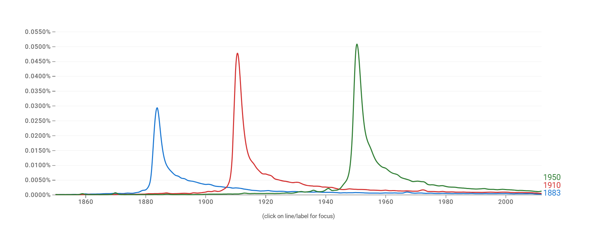

# Description

This is a template for exercise 6 in Chapter 2 of [Bit By Bit: Social Research in the Digital Age](https://www.bitbybitbook.com/en/1st-ed/observing-behavior/observing-activities/) by Matt Salganik. The problem is reprinted here with some additional comments and structure to facilitate a solution.

The original problem statement:

> In a widely discussed paper, Michel and colleagues ([2011](https://doi.org/10.1126/science.1199644)) analyzed the content of more than five million digitized books in an attempt to identify long-term cultural trends. The data that they used has now been released as the Google NGrams dataset, and so we can use the data to replicate and extend some of their work.
>
> In one of the many results in the paper, Michel and colleagues argued that we are forgetting faster and faster. For a particular year, say “1883,” they calculated the proportion of 1-grams published in each year between 1875 and 1975 that were “1883”. They reasoned that this proportion is a measure of the interest in events that happened in that year. In their figure 3a, they plotted the usage trajectories for three years: 1883, 1910, and 1950. These three years share a common pattern: little use before that year, then a spike, then decay. Next, to quantify the rate of decay for each year, Michel and colleagues calculated the “half-life” of each year for all years between 1875 and 1975. In their figure 3a (inset), they showed that the half-life of each year is decreasing, and they argued that this means that we are forgetting the past faster and faster. They used Version 1 of the English language corpus, but subsequently Google has released a second version of the corpus. Please read all the parts of the question before you begin coding.
>
> This activity will give you practice writing reusable code, interpreting results, and data wrangling (such as working with awkward files and handling missing data). This activity will also help you get up and running with a rich and interesting dataset.

The full paper can be found [here](https://aidenlab.org/papers/Science.Culturomics.pdf), and this is the original figure 3a that you're going to replicate:

> 

# Part A

> Get the raw data from the [Google Books NGram Viewer website](http://storage.googleapis.com/books/ngrams/books/datasetsv2.html). In particular, you should use version 2 of the English language corpus, which was released on July 1, 2012. Uncompressed, this file is 1.4GB.

## Get and clean the raw data

Edit the `01_download_1grams.sh` file to download the `googlebooks-eng-all-1gram-20120701-1.gz` file and the `02_filter_1grams.sh` file to filter the original 1gram file to only lines where the ngram matches a year (output to a file named `year_counts.tsv`).

Then edit the `03_download_totals.sh` file to down the `googlebooks-eng-all-totalcounts-20120701.txt` and  file and the `04_reformat_totals.sh` file to reformat the total counts file to a valid csv (output to a file named `total_counts.csv`). 

## Load the cleaned data

Load in the `year_counts.tsv` and `total_counts.csv` files. Use the `here()` function around the filename to keep things portable.Give the columns of `year_counts.tsv` the names `term`, `year`, `volume`, and `book_count`. Give the columns of `total_counts.csv` the names `year`, `total_volume`, `page_count`, and `book_count`. Note that column order in these files may not match the examples in the documentation.


``` r
# Define file paths and Create columns names for year_counts.tsv
year_counts <- read_tsv(
  here('week3','ngrams',"year_counts.tsv"),
  col_names = c("term", "year", "volume", "book_count")
)
```

```
## Rows: 53393 Columns: 4
## -- Column specification ---------------------------------------------------------------------
## Delimiter: "\t"
## dbl (4): term, year, volume, book_count
## 
## i Use `spec()` to retrieve the full column specification for this data.
## i Specify the column types or set `show_col_types = FALSE` to quiet this message.
```

``` r
# Define file paths and Create columns names for total_counts.csv
total_counts <- read_csv(
  here('week3','ngrams',"total_counts.csv"),
  col_names = c("year", "total_volume", "page_count", "book_count")
)
```

```
## Rows: 425 Columns: 4
## -- Column specification ---------------------------------------------------------------------
## Delimiter: ","
## dbl (4): year, total_volume, page_count, book_count
## 
## i Use `spec()` to retrieve the full column specification for this data.
## i Specify the column types or set `show_col_types = FALSE` to quiet this message.
```

## Your written answer

Add a line below using Rmarkdown's inline syntax to print the total number of lines in each dataframe you've created.
 
The `year_counts` dataframe has 53393 rows.  
The `total_counts` dataframe has 425 rows.

# Part B

> Recreate the main part of figure 3a of Michel et al. (2011). To recreate this figure, you will need two files: the one you downloaded in part (a) and the “total counts” file, which you can use to convert the raw counts into proportions. Note that the total counts file has a structure that may make it a bit hard to read in. Does version 2 of the NGram data produce similar results to those presented in Michel et al. (2011), which are based on version 1 data?

## Join ngram year counts and totals

Join the raw year term counts with the total counts and divide to get a proportion of mentions for each term normalized by the total counts for each year.


``` r
ensemble <- full_join(year_counts, total_counts, by = "year")%>%
  mutate(proportion = volume / total_volume)
```

## Plot the main figure 3a

Plot the proportion of mentions for the terms "1883", "1910", and "1950" over time from 1850 to 2012, as in the main figure 3a of the original paper. Use the `percent` function from the `scales` package for a readable y axis. Each term should have a different color, it's nice if these match the original paper but not strictly necessary.


``` r
filtered_year <- ensemble %>%
  filter(term %in% c("1883", "1910", "1950") & (year <= 2012 & year >= 1850))%>%
  filter(!is.na(proportion)) %>%
  mutate(term = factor(trimws(as.character(term)),
          levels = c("1883", "1910", "1950")))

  ggplot(filtered_year,aes(x=year, y=proportion, color=term))+
    scale_y_continuous(labels = scales::percent)+
    labs(x="Year", y="Frequency", color="Term Years")+
    geom_line()
```

<!-- --> 

## Your written answer

Write up your answer to Part B here.
 
Yes, the version 2 produces almost similar results to the version 1.
We note a spike near each term year and decline right after, on both graphs.
The difference I see on the two versions is that the decay speed looks faster 
on version 2 than the first one. But overall, both versions are pretty similar.

# Part C

> Now check your graph against the graph created by the [NGram Viewer](https://books.google.com/ngrams/).

## Compare to the NGram Viewer

Go to the ngram viewer, enter the terms "1883", "1910", and "1950" and take a screenshot.

## Your written answer

Add your screenshot for Part C below this line using the `` syntax and comment on similarities / differences.
 

We can still note the spike near each term year and decline right after on both graph.
However, the two graphs have some small differences. First, the lines are smooth in the 
ngram viewer compare to the version 2 where they have some deviations. 
Additionally, the frequency at each peak year is different on both graphs. The ones on the ngram viewer
goes higher than the ones on the version2. 
Adding to that, that the decay speed looks faster on the ngram viewer than the version 2 one.


# Part D

> Recreate figure 3a (main figure), but change the y-axis to be the raw mention count (not the rate of mentions).

## Plot the main figure 3a with raw counts

Plot the raw counts for the terms "1883", "1910", and "1950" over time from 1850 to 2012. Use the `comma` function from the `scales` package for a readable y axis. The colors for each term should match your last plot, and it's nice if these match the original paper but not strictly necessary.


``` r
filtered_year <- ensemble %>%
  filter(term %in% c("1883", "1910", "1950") & (year <= 2012 & year >= 1850))%>%
  mutate(term = factor(trimws(as.character(term)),
          levels = c("1883", "1910", "1950")))

  ggplot(filtered_year, aes(x=year, y=volume, color=term, group=term))+
    scale_y_continuous(labels = scales::comma)+
    labs(x="Year", y="Raw counts for the different term years", color="Term Years")+
    geom_line()
```

<!-- --> 

# Part E

> Does the difference between (b) and (d) lead you to reevaluate any of the results of Michel et al. (2011). Why or why not?

As part of answering this question, make an additional plot.

## Plot the totals

Plot the total counts for each year over time, from 1850 to 2012. Use the `comma` function from the `scales` package for a readable y axis. There should be only one line on this plot (not three).


``` r
total_counts %>%
  filter(year <= 2012 & year >= 1850)%>%
  ggplot(aes(x=year, y=total_volume))+
    scale_y_continuous(labels = scales::comma)+
    labs(x = "Year", y = "Total counts for each year")+
    geom_line()
```

<!-- --> 

## Your written answer

Write up your answer to Part E here.

In Part D, absolute raw counts rise over time, but this is expected because the corpus size also grows. 
In Part B, proportions are normalized by total yearly volume, so they better reflect relative attention across years. 
Since the totals plot (E) shows strong growth in total words over time, the raw-count increase alone isn't an evidence of 
stronger memory. Therefore, I wouldn't substantially reevaluate Michel et al.'s result.


# Part F

> Now, using the proportion of mentions, replicate the inset of figure 3a. That is, for each year between 1875 and 1975, calculate the half-life of that year. The half-life is defined to be the number of years that pass before the proportion of mentions reaches half its peak value. Note that Michel et al. (2011) do something more complicated to estimate the half-life—see section III.6 of the Supporting Online Information—but they claim that both approaches produce similar results. Does version 2 of the NGram data produce similar results to those presented in Michel et al. (2011), which are based on version 1 data? (Hint: Don’t be surprised if it doesn’t.)

## Compute peak mentions

For each year term, find the year where its proportion of mentions peaks (hits its highest value). Store this in an intermediate dataframe.


``` r
peak <- ensemble%>%
    filter(!is.na(proportion)) %>%
    filter((term <= 1975 & term >= 1875) & (year <=2012 & year >= 1850))%>%
    group_by(term)%>%
    filter(proportion == max(proportion))%>%
    select(term, year, proportion)%>%
    arrange(term)
```

## Compute half-lifes

Now, for each year term, find the minimum number of years it takes for the proportion of mentions to decline from its peak value to half its peak value. Store this in an intermediate data frame.


``` r
half_life <- left_join(peak, ensemble, by = "term") %>%
  filter(((proportion.x / proportion.y) >= 2) & (year.x < year.y)) %>%
  filter(year.y <=2012 & year.y >= 1850) %>%
  mutate(dif = year.y - year.x)%>%
  group_by(term)%>%
  summarise(min_year = min(dif))
```

## Plot the inset of figure 3a

Plot the half-life of each term over time from 1850 to 2012. Each point should represent one year term, and add a line to show the trend using `geom_smooth()`.


``` r
ggplot(half_life, aes(x=term, y=min_year))+
  geom_smooth()+
  geom_point()+
  labs(x= "Term Year", y = "Minimum amount of years for the peak")
```

```
## `geom_smooth()` using method = 'loess' and formula = 'y ~ x'
```

<!-- --> 

## Your written answer

Write up your answer to Part F here.

The half life trend in Michel et al.'s version is decreasing consistently , but the version 2 graph 
isn't monotonic. In my version 2 results, the half life increases up until about 1912, 
decreases from roughly 1912 to 1937, then increases slowly afterward. This shows that the version 2 
of the Ngram data doesn't reproduce the same consistently decreasing pattern reported in the original figure. 
A reason might be the differences in the corpus construction and the simpler half-life definition we used here in version 2.


# Part G

> Were there any years that were outliers such as years that were forgotten particularly quickly or particularly slowly? Briefly speculate about possible reasons for that pattern and explain how you identified the outliers.

## Your written answer

Write up your answer to Part G here. Include code that shows the years with the smallest and largest half-lifes.

``` r
half_life%>%
  arrange(desc(min_year))%>%
  head()
```

```
## # A tibble: 6 x 2
##    term min_year
##   <dbl>    <dbl>
## 1  1900       19
## 2  1910       18
## 3  1893       17
## 4  1896       16
## 5  1905       16
## 6  1906       16
```

``` r
half_life%>%
  arrange(min_year)%>%
  slice_head(n=6)
```

```
## # A tibble: 6 x 2
##    term min_year
##   <dbl>    <dbl>
## 1  1877        4
## 2  1878        4
## 3  1942        4
## 4  1881        5
## 5  1917        5
## 6  1918        5
```

1900, 1910, and 1893 are one of the years with the largest half-life 
meaning they were forgotten particulary slowly. We note that:
- 1893 is when New Zealand became the first country to grant women the right to vote, marking a major milestone in the global suffrage movement.
- 1900, in the United States, the Galveston hurricane struck Texas on September 8, causing over 6,000 fatalities and making it one of the deadliest natural disasters in American history.
  It also marks the birth of Quantum Theory of modern physics.
- 1910 is when the National Association for the Advancement of Colored People (NAACP) was founded in the United States, advocating for civil rights and fighting racial discrimination. 
  Internationally, King George V ascended to the British throne following the death of Edward VII, marking a significant moment in the monarchy and British imperial history.

1917, 1918, and 1942 are one of the years with the smallest half-life
meaning that they were forgotten particularly quickly. We note that:
- 1917 is the year of Russian Revolutions (February/March and October), US enters World War I, and key battles and political developments in Europe and the Middle East occur.
- 1918 marks Russia's exit of WWI. The German Spring Offensive fails, US troops majorly engaged, WWI ends with Armistice, Spanish flu pandemic, and the reshaping of Europe through treaties.
- 1942 is for Pivotal World War II battles and operations, including Midway, Operation Torch, the escalation of the Holocaust, and strategic developments across Pacific, Europe, and North Africa occur.
All these years represent seismic shifts in geopolitics, warfare, and social structures, setting the stage for modern international relations.

# Makefile

Edit the `Makefile` in this directory to execute the full set of scripts that download the data, clean it, and produce this report. This must be turned in with your assignment such that running `make` on the command line produces the final report as a pdf file.
